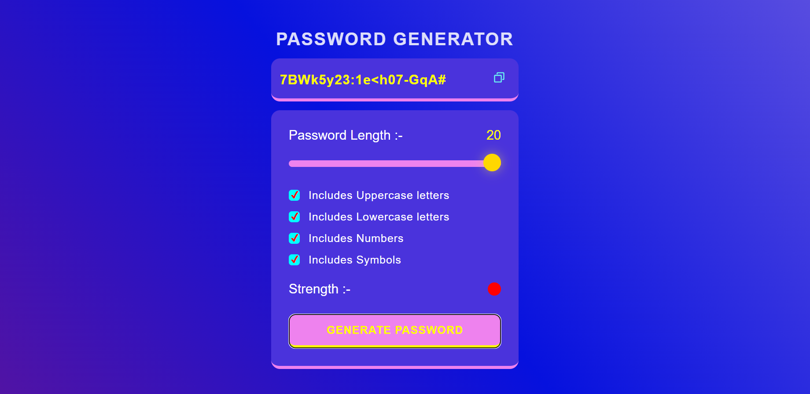

# 🔐 PassCode

A simple and interactive password generator that allows users to create strong, customizable passwords with ease. The website offers options for password length and the inclusion of uppercase letters, lowercase letters, numbers, and symbols.

[](https://pass-code-delta.vercel.app/)

---

## ✨ Features

- 🔢 **Customizable Password Length** (6-20 characters)
- ✅ **Multiple Character Type Options**:
  - 🔠 Uppercase letters
  - 🔡 Lowercase letters
  - 🔢 Numbers
  - 🔣 Special symbols
- 🚦 **Real-time Password Strength Indicator**
- 📋 **Copy to Clipboard Functionality**
- 📱 **Responsive Design**

---

## 🗂 Project Structure

```plaintext
project/
├── index.html
├── styles.css
├── script.js
├── image.png
├── scopy.svg
└── README.md
```

## 🛠 Technical Implementation

### 🔑 Password Generation

- 🔄 **Fisher-Yates Shuffle Algorithm** for secure password randomization
- 🎛 **Character Set Selection** based on user preferences
- 📏 **Minimum Length Validation**
- 🔒 **Character Type Enforcement**

### 🌈 Password Strength

- 🔍 **Real-Time Strength Calculation**
- 🎨 **Color-Coded Indicators**:
  - 🟥 **Red**: Strong (Uppercase, Lowercase, Numbers/Symbols, Length ≥ 8)
  - 🟨 **Yellow**: Moderate (Uppercase/Lowercase, Numbers/Symbols, Length ≥ 6)
  - 🟩 **Green**: Basic (Minimum Requirements)

### 🖥 User Interface

- 📏 **Interactive Slider** for password length
- ✅ **Checkbox Controls** for character types
- 📋 **Copy Button** with visual feedback
- 🔎 **Password Display Field**

---

## 🚀 Usage

1. ✅ **Select Desired Character Types** using the checkboxes
2. 🎛 **Adjust Password Length** using the slider
3. 🔄 **Click "Generate"** to create a new password
4. 📋 **Use the Copy Button** to copy the password to clipboard

---

## 🌐 Browser Support

The application uses modern web APIs and is compatible with:

- 🌐 **Chrome**
- 🦊 **Firefox**
- 🍎 **Safari**
- 🖥 **Edge**

---

## 📝 Development Notes

- ✍️ Built using **Vanilla JavaScript**
- 🛠 No external dependencies required
- 📱 Responsive design using **CSS**
- 📋 Utilizes **Modern Clipboard API** for secure copying

---

## 📜 License

This project is licensed under the MIT License. See [LICENSE](./LICENSE) for details.
